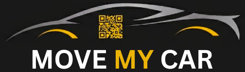
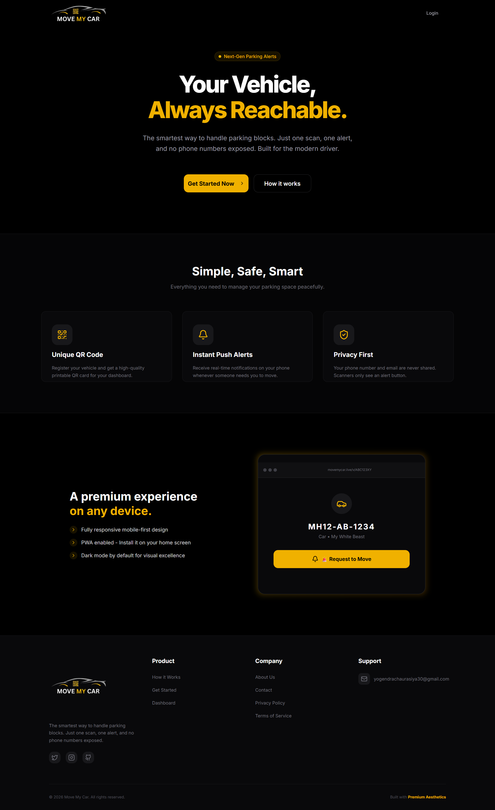
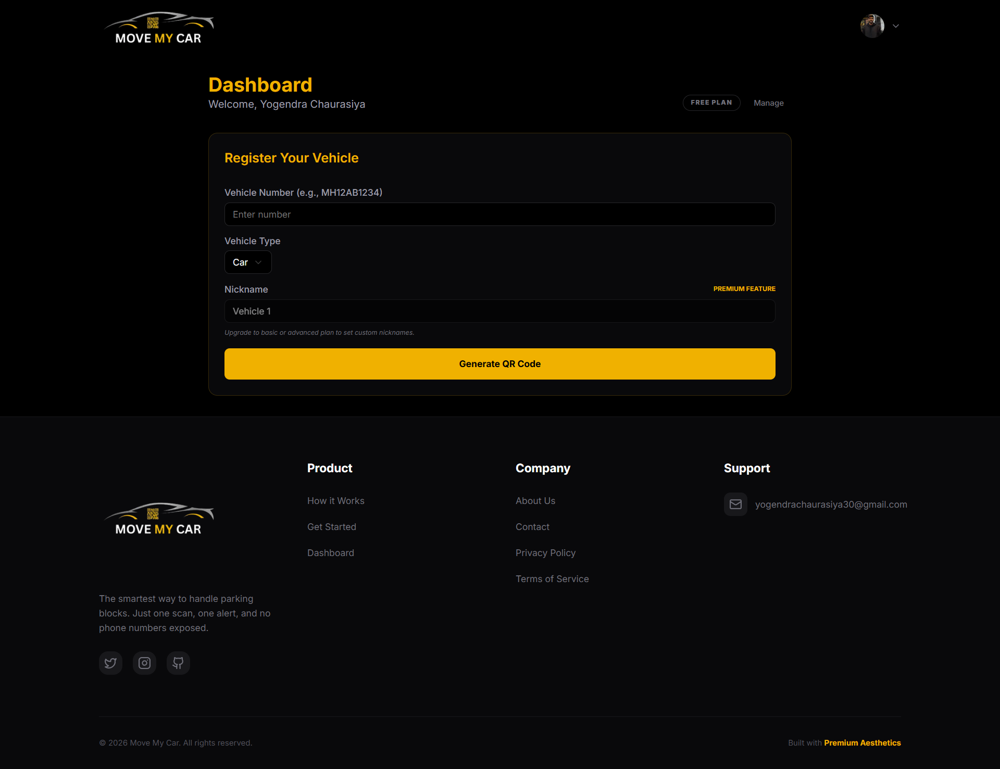
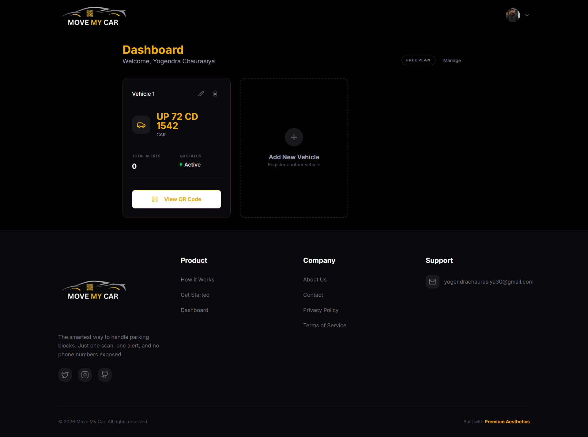
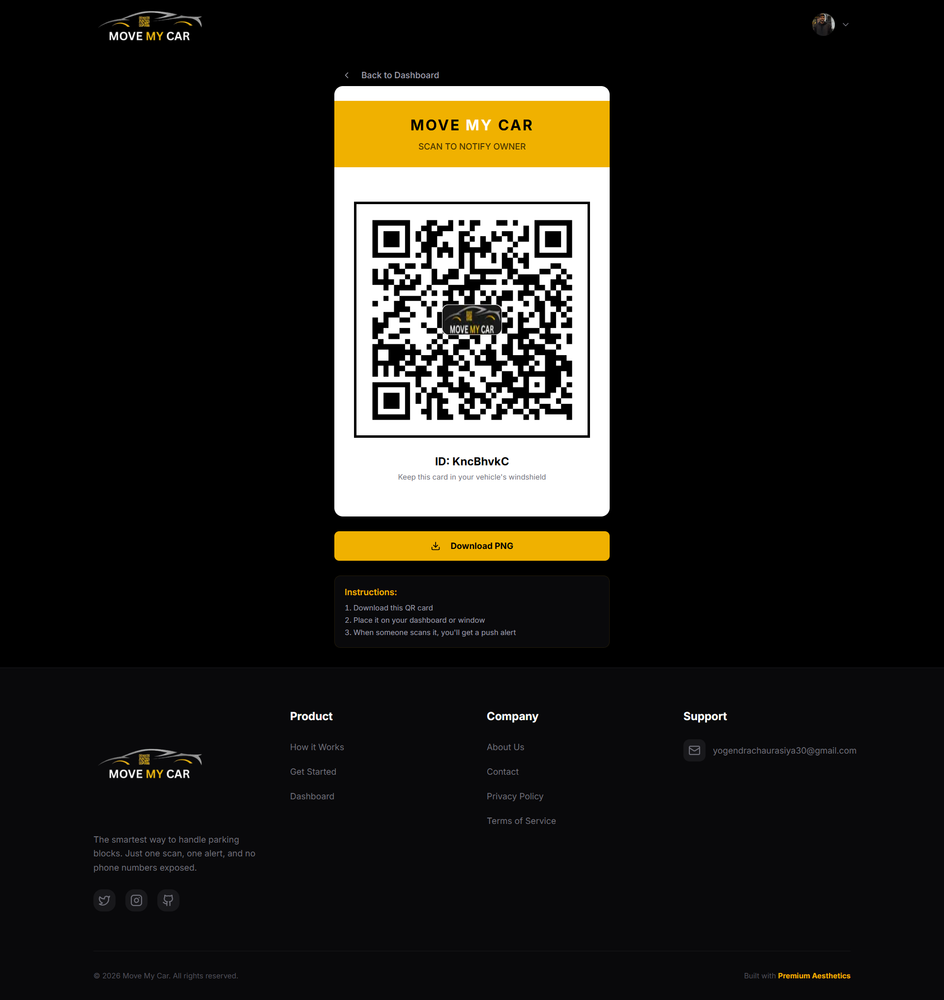
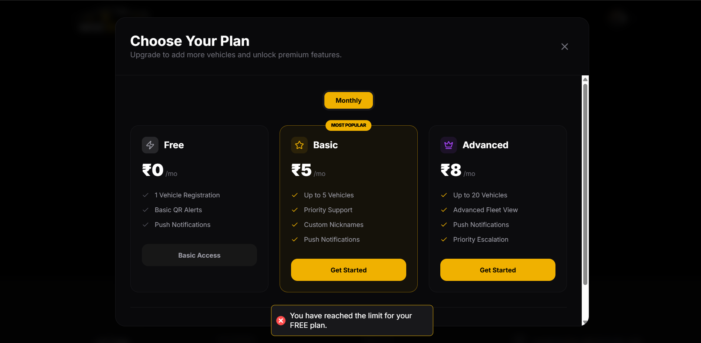
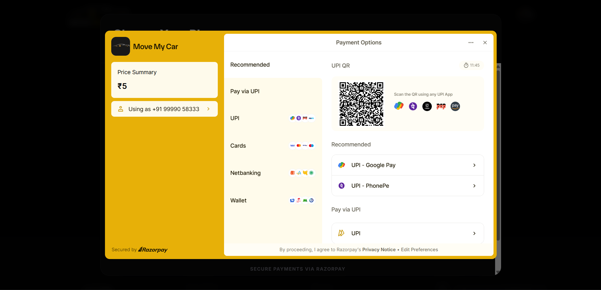
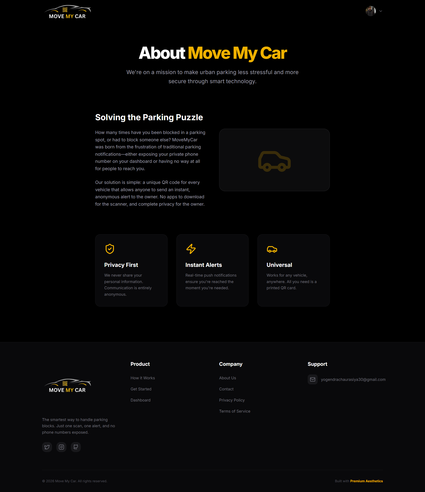
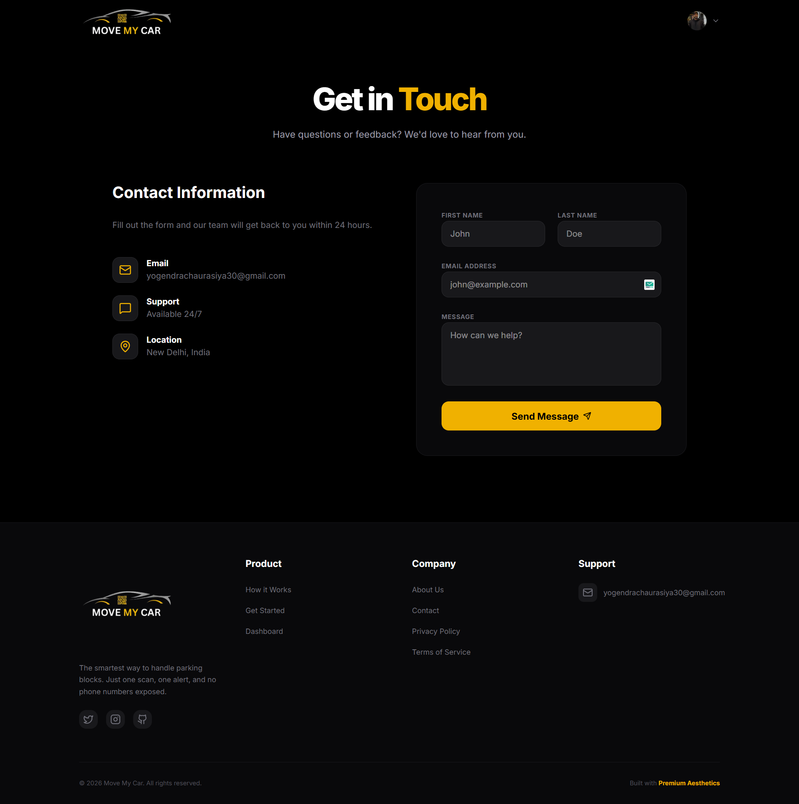

  

  # Move My Car 🚗

  **The smartest way to handle parking blocks.**  
  One scan. One alert. Zero phone numbers exposed.

  
  
  
  

---

> [!CAUTION]
> ⚠️ This repository is source-available for transparency and portfolio purposes.
> Commercial use, resale, or self-hosting with payment removal is not permitted.
> See [LICENSE](./LICENSE) for details.

---

## 📸 Screenshots

| Landing Page | Dashboard |
|---|---|
|  |  |

| Vehicle Dashboard | QR Code View |
|---|---|
|  |  |

| Pricing Plans | Razorpay Payment |
|---|---|
|  |  |

| About Page | Contact Page |
|---|---|
|  |  |

---

## ✨ Features

### 🔒 Privacy-First Parking Alerts
- Your **phone number and email are never exposed** — scanners only see an alert button
- Anyone can scan your QR code and notify you instantly, with zero personal data shared
- Completely anonymous communication between scanner and vehicle owner

### 📲 Instant Push Notifications
- Receive **real-time push alerts** on your phone the moment someone scans your QR code
- Uses Firebase Cloud Messaging (FCM) for reliable delivery
- Live dashboard updates via Supabase Realtime — no page refresh needed

### 🔲 Unique QR Code Per Vehicle
- Generate a **branded, printable QR card** for each registered vehicle
- Download as PNG and place it on your dashboard or windshield
- Each QR code has a unique ID linked only to your alert profile

### 🚘 Multi-Vehicle Management
- Register and manage **multiple vehicles** from one dashboard
- Supports Cars, Bikes, Trucks, and more
- Edit or delete vehicle registrations anytime
- Track **total alert count** per vehicle

### 💳 Flexible Subscription Plans
| Plan | Price | Vehicles | Features |
|---|---|---|---|
| **Free** | ₹0/mo | 1 | Basic QR Alerts, Push Notifications |
| **Basic** | ₹5/mo | Up to 5 | Priority Support, Custom Nicknames, Push Notifications |
| **Advanced** | ₹8/mo | Up to 20 | Advanced Fleet View, Priority Escalation, Push Notifications |

### 💰 Secure Payments via Razorpay
- Supports **UPI, Cards, Netbanking, and Wallets**
- Payments secured and processed by Razorpay

### 📱 Progressive Web App (PWA)
- **Install on your home screen** — works like a native app
- Fully responsive, mobile-first design
- Dark mode by default for visual excellence

---

## 📥 How to Install the App

Move My Car is a **Progressive Web App (PWA)** — no app store needed!

1. Open your browser and visit **[www.qrparkalert.online](https://www.qrparkalert.online)**
2. Tap the **☰ hamburger menu** (top-right corner of your browser or the site header)
3. Tap **"Download App"** / **"Add to Home Screen"**
4. The app will be installed on your device, ready to use offline-first like a native app

> **Tip:** On Android with Chrome, you'll see an "Add to Home screen" prompt. On iOS with Safari, tap the Share button and then "Add to Home Screen".

---

## 🚀 How to Use

### Step 1 — Sign Up / Log In
- Visit [www.qrparkalert.online](https://www.qrparkalert.online) and click **"Get Started Now"**
- Sign in using your Google account (one click, no password needed)

### Step 2 — Register Your Vehicle
- After logging in, you'll land on the **Dashboard**
- Fill in your **Vehicle Number** (e.g., MH12AB1234)
- Select your **Vehicle Type** (Car, Bike, Truck, etc.)
- Optionally give it a **Nickname** (e.g., "My White Beast") — available on paid plans
- Click **"Generate QR Code"**

### Step 3 — Get Your QR Card
- Your unique QR card will be generated instantly
- Click **"Download PNG"** to save it
- Print it and **place it on your vehicle's dashboard or windshield**

### Step 4 — Receive Alerts
- Whenever someone **scans your QR code**, you'll receive an **instant push notification** on your phone
- No app required for the person scanning — they just scan and tap the alert button in their browser
- Your contact details remain 100% private throughout

### Step 5 — Manage Your Fleet
- From the Dashboard, view all your registered vehicles
- See the **total alert count** for each vehicle
- Edit vehicle details or delete a registration anytime
- Upgrade your plan to add more vehicles

---

## 🔮 Future Features (Roadmap)

These features are planned for upcoming releases:

| Feature | Description |
|---|---|
| 📱 **Native Android & iOS App** | Dedicated native apps on Google Play Store and Apple App Store for a smoother, faster experience with deeper OS integration |
| 🔊 **Alarm-Style Alert Notifications** | High-priority sound & vibration alerts that break through Do Not Disturb — just like an alarm — so you never miss an urgent parking request |
| 🔁 **Repeated Push Notification** | If the first alert goes unacknowledged, the system automatically re-notifies the vehicle owner every **5 minutes** until they respond |
| 📞 **Anonymous Call Feature** | Allow the scanner to call the vehicle owner directly through the app — without ever exposing either party's real phone number — using masked/proxy calling |

---

## 🛠️ Tech Stack

| Layer | Technology |
|---|---|
| **Frontend** | Next.js 15, TypeScript, Tailwind CSS |
| **Auth** | Firebase Authentication (Google OAuth) |
| **Database** | Supabase (PostgreSQL) |
| **Realtime** | Supabase Realtime Channels |
| **Push Notifications** | Firebase Cloud Messaging (FCM) |
| **Payments** | Razorpay |
| **Hosting** | Vercel |

---

## 🤝 Support & Contact

- 📧 Email: [yogendrachaurasiya30@gmail.com](mailto:yogendrachaurasiya30@gmail.com)
- 🌐 Website: [www.qrparkalert.online](https://www.qrparkalert.online)
- 🕐 Support available 24/7

---

  Built with <strong>Premium Aesthetics</strong> — © 2026 Move My Car. All rights reserved.

